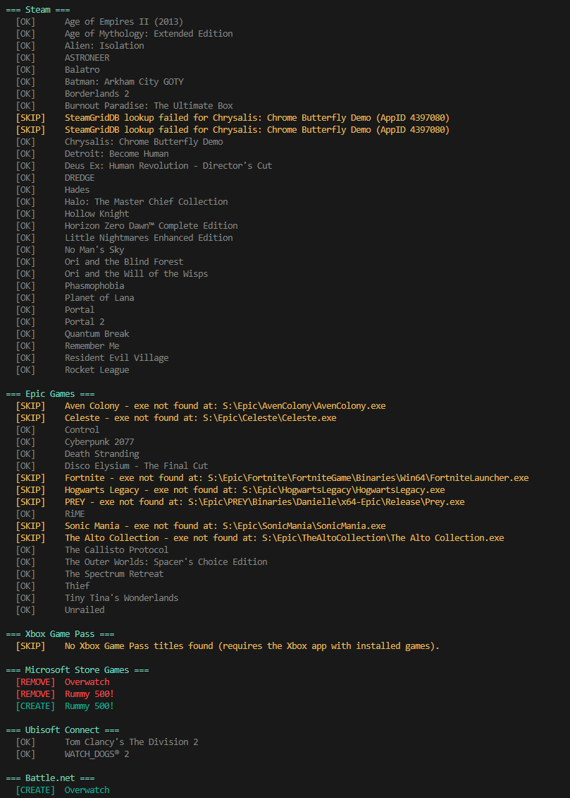
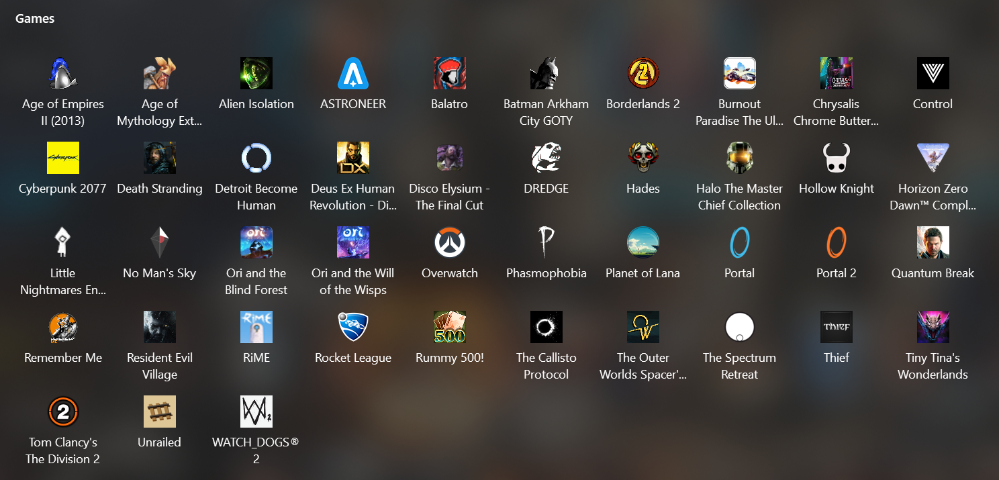

# GameIcons

GameIcons is a PowerShell script that builds and maintains a single Windows Start Menu Games folder from the launchers you already use.

It detects installed games, creates missing shortcuts, repairs broken icon links, migrates legacy shortcut names, and removes stale shortcuts for uninstalled titles.

## Screenshots

### Script Output




### Start Menu Icons



## What It Supports

Launchers and stores currently handled by the script:

| Platform | Detection Source | Shortcut Type |
|---|---|---|
| Steam | Steam library manifests across all Steam library folders | .url |
| Epic Games | Epic launcher .item manifests | .url |
| Xbox Game Pass | Installed AppX packages with Xbox Live indicators | .lnk |
| Microsoft Store | Installed AppX packages with game capabilities, plus include list | .lnk |
| Ubisoft Connect | Launcher metadata, existing shortcuts, install folders, registry fallback | .url |
| Battle.net | Windows uninstall registry entries | .lnk |
| GOG | Windows uninstall registry entries | .lnk |
| itch.io | Scans itch apps library for launchable executables | .lnk |
| EA App | Windows uninstall registry entries | .lnk |
| Rockstar | Windows uninstall registry entries | .lnk |

## Features

- Unified output folder for all supported platforms.
- Automatic cleanup for shortcuts that no longer match installed games.
- Legacy shortcut migration from underscore naming to spaced naming.
- Icon repair flow for shortcuts that point to missing or outdated icon files.
- Custom icon overrides per game.
- Steam icon enrichment with SteamGridDB and local caching.
- WhatIf support through standard PowerShell ShouldProcess behavior.

## Requirements

- Windows 10 or Windows 11.
- PowerShell 5.1 or newer.
- No external PowerShell modules required.

## Known Limitations

- Detection quality depends on each launcher's local metadata and uninstall registry entries.
- Some portable or manually copied game installs may not be detected.
- Microsoft Store and Xbox detection depends on AppX manifest capabilities, which are not always consistent.
- Ubisoft detection can find inferred installs without launch IDs, and those are skipped when they cannot produce a valid launcher target.
- Some launchers update executable paths after patches, so a run may need to repair shortcuts.
- Icon cache behavior is controlled by Windows shell caching; icon updates may not appear until cache refresh/restart.

## Quick Start

1. Clone or download this repository.
2. Open PowerShell in the repository root.
3. Optional dry run:

```powershell
.\Sync.ps1 -WhatIf
```

4. Run for real:

```powershell
.\Sync.ps1
```

By default, shortcuts are written to:

```text
%APPDATA%\Microsoft\Windows\Start Menu\Programs\Games
```

## Script Parameters

Sync.ps1 intentionally keeps the CLI surface small:

| Parameter | Default | Description |
|---|---|---|
| GamesMenu | %APPDATA%\Microsoft\Windows\Start Menu\Programs\Games | Destination folder for all generated shortcuts |
| SkipIconCacheRefresh | False | Skips final shell icon cache refresh |
| SkipExplorerRestart | False | Skips Explorer restart after cache refresh |

Examples:

```powershell
.\Sync.ps1 -GamesMenu "$env:APPDATA\Microsoft\Windows\Start Menu\Programs\My Games"
.\Sync.ps1 -SkipIconCacheRefresh
.\Sync.ps1 -SkipExplorerRestart
```

## Validation and Testing

Use this checklist before opening a PR or cutting a release:

1. Run a dry run and verify expected actions.

```powershell
.\Sync.ps1 -WhatIf
```

2. Run a full sync.

```powershell
.\Sync.ps1
```

3. Verify output quality:
- Shortcuts are created in the target Games folder.
- No unexpected removals are reported.
- Icon paths resolve to valid files for representative games.

4. Validate launcher coverage:
- Confirm at least one title from each installed launcher updates correctly.

5. Validate cache behavior:
- Confirm UwpIconCache and SteamGridDbCache are created and reused.

6. Validate shell refresh behavior:
- Run once with default behavior.
- Run once with SkipIconCacheRefresh and SkipExplorerRestart to confirm both toggles.

## Configuration

Most behavior is controlled from settings.json.

### Paths

The paths object supports:

- steamInstall
- epicManifests
- ubisoftInstall
- battleNetInstall
- gogInstall
- itchInstall
- eaAppInstall
- rockstarInstall
- gamesMenu
- uwpIconCache
- steamGridDbCache
- customIconsPath

Example:

```json
{
  "paths": {
    "steamInstall": "C:\\Program Files (x86)\\Steam",
    "epicManifests": "C:\\ProgramData\\Epic\\EpicGamesLauncher\\Data\\Manifests",
    "gamesMenu": "%APPDATA%\\Microsoft\\Windows\\Start Menu\\Programs\\Games",
    "uwpIconCache": "UwpIconCache",
    "steamGridDbCache": "SteamGridDbCache",
    "customIconsPath": "CustomIcons"
  }
}
```

Notes:

- Environment variables in settings are expanded.
- Relative cache/icon paths are resolved from the repository root.
- The GamesMenu parameter takes precedence over settings.json.

### Store and UWP Filtering

settings.json also supports:

- steamNonGameIds
- uwpServicePackageNames
- msPublisherPrefixes
- includeStorePackages

includeStorePackages is useful for Store games that do not declare standard gaming capabilities.

Example:

```json
{
  "includeStorePackages": [
    "TrivialTechnology.UltimateRummy500",
    "SomePublisher.*"
  ]
}
```

### SteamGridDB Icon Preferences

You can pin or exclude SteamGridDB icon IDs:

- steamGridDbPreferredIconIds
- steamGridDbExcludedIconIds

Keys can be app IDs or game names.

Example:

```json
{
  "steamGridDbPreferredIconIds": {
    "1091500": "86095",
    "Cyberpunk 2077": "86095"
  },
  "steamGridDbExcludedIconIds": {
    "1091500": ["11111", "22222"]
  }
}
```

## SteamGridDB API Key Setup

SteamGridDB is enabled by default, but a key is optional.

Resolution order used by the script:

1. Current process environment variable STEAMGRIDDB_API_KEY.
2. User environment scope.
3. Machine environment scope.
4. Local .env file in repo root.

Set for the current terminal session:

```powershell
$env:STEAMGRIDDB_API_KEY = "your-api-key"
.\Sync.ps1
```

Persist for future terminals:

```powershell
setx STEAMGRIDDB_API_KEY "your-api-key"
```

Or use a local .env file:

```dotenv
STEAMGRIDDB_API_KEY=your-api-key
```

Security notes:

- Keep .env local and never commit real keys.
- .env.example is intended for placeholders only.
- .gitignore already excludes .env.

## Icon Resolution Priority

### Steam

Priority chain:

1. CustomIcons override.
2. SteamGridDB official style.
3. SteamGridDB official and custom styles.
4. Previously cached icon assets.
5. Local Steam client icon or library cache artwork.
6. Steam CDN artwork fallback.
7. Native game executable icon fallback.

### Epic, Xbox, Microsoft Store

1. CustomIcons override.
2. SteamGridDB preferred entry when configured by game name.
3. Platform-native icon source.

### Ubisoft, Battle.net, GOG, itch.io, EA App, Rockstar

1. CustomIcons override.
2. Game executable icon.

## Custom Icon Overrides

Place .ico or .png files in CustomIcons with a filename matching the sanitized game name.

Examples:

```text
CustomIcons/
  Halo The Master Chief Collection.ico
  Balatro.png
```

When a matching PNG exists, it is converted to ICO automatically.

## Output Statuses

The script reports one of these states per game:

| Status | Meaning |
|---|---|
| [CREATE] | Shortcut did not exist and was created |
| [OK] | Shortcut and icon are valid |
| [FIX] | Shortcut existed but target/icon/details were repaired |
| [REMOVE] | Shortcut removed because game is missing or unrecoverable |
| [SKIP] | Game could not be processed (missing source, icon, or executable) |
| [MIGRATE] | Legacy shortcut naming moved to current naming |
| [WARN] | Non-fatal warning |

## Generated Caches

| Path | Purpose |
|---|---|
| UwpIconCache | Cached ICO files from UWP package assets |
| SteamGridDbCache | Cached SteamGridDB and Steam CDN icon assets |

Both are safe to delete and will be regenerated as needed.

## Project Layout

| Path | Role |
|---|---|
| Sync.ps1 | Entry point and orchestration |
| Setup-GitHooks.ps1 | One-command setup for repo hooks and gitleaks validation |
| settings.json | Main configuration |
| Partials/Helpers.ps1 | Shared helpers and settings parsing |
| Partials/IconResolution.ps1 | SteamGridDB, image conversion, cache helpers |
| Partials/ShortcutOperations.ps1 | URL and LNK read/write helpers |
| Partials/Settings.ps1 | Runtime settings initialization and path resolution |
| Partials/Platforms | Per-platform detection and sync logic |
| CustomIcons | Optional manual icon overrides |

## Troubleshooting

### No games found for a launcher

- Verify the launcher is installed and has at least one installed game.
- Check corresponding paths in settings.json.
- For Store titles with unusual manifests, add package names to includeStorePackages.

### Icons look stale after run

- Run without SkipIconCacheRefresh so shell cache refresh executes.
- If needed, allow Explorer restart by omitting SkipExplorerRestart.

### SteamGridDB lookups fail

- Confirm STEAMGRIDDB_API_KEY is set correctly.
- Confirm network access to steamgriddb.com.
- Retry later if rate limited.

### Wrong game icon selected

- Add a custom icon in CustomIcons.
- Or pin a specific SteamGridDB ID in steamGridDbPreferredIconIds.

## Safe Operations and Secrets

- Keep secrets in environment variables or local .env only.
- Do not store real API keys in settings.json.
- Before pushing, review staged files with git diff --staged.

### Optional Pre-Commit Secret Scan (Recommended)

This repository includes a gitleaks config and sample git hook under .githooks.

Fast path (recommended):

```powershell
.\Setup-GitHooks.ps1
```

This script sets core.hooksPath and runs a staged gitleaks scan when available.

1. Install gitleaks.

```powershell
winget install Gitleaks.Gitleaks
```

2. Enable repo hooks.

```powershell
git config core.hooksPath .githooks
```

3. Test the scanner manually.

```powershell
gitleaks protect --staged --config .gitleaks.toml --redact
```

If a secret is detected, commit is blocked until the issue is fixed or intentionally allowlisted.

## License

This project is licensed under the MIT License. See LICENSE for details.